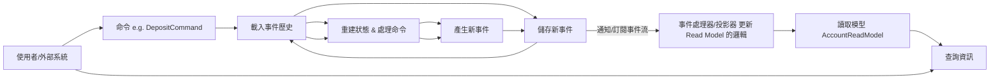
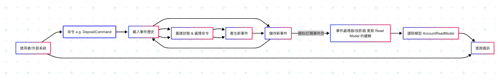

# Getting Started

這個範例將模擬一個基本的銀行帳戶系統，包含「建立帳戶」、「存款」和「提款」等操作。我們將狀態變更儲存為事件序列。

**核心概念對應：**

*   **Aggregate (聚合):** `Account` (帳戶)
*   **Commands (命令):** `CreateAccountCommand`, `DepositCommand`, `WithdrawCommand`
*   **Events (事件):** `AccountCreatedEvent`, `MoneyDepositedEvent`, `MoneyWithdrawnEvent`
*   **Event Store (事件儲存):** 我們將使用一個簡單的 JPA 實體和 H2 資料庫來模擬儲存事件。
*   **Command Handler (命令處理器):** 接收命令，從事件儲存載入聚合，處理命令，並儲存新事件。
*   **Read Model (讀取模型):** 為了方便查詢當前狀態，我們將維護一個單獨的 `AccountReadModel` 實體，由事件處理器更新。

**專案結構：**

```
src/main/java/com/example/eventsourcing
├── EventSourcingApplication.java
├── domain
│   ├── Account.java          // 聚合 (Aggregate)
│   └── events                // 事件 (Events)
│       ├── AccountCreatedEvent.java
│       ├── AccountEvent.java // 事件基類
│       ├── MoneyDepositedEvent.java
│       └── MoneyWithdrawnEvent.java
├── command                   // 命令 (Commands)
│   ├── CreateAccountCommand.java
│   ├── DepositCommand.java
│   └── WithdrawCommand.java
├── eventstore                // 事件儲存 (Event Store)
│   ├── EventStore.java       // 介面
│   ├── JpaEventStore.java    // 實作
│   └── StoredEvent.java      // JPA 實體
├── commandhandling           // 命令處理 (Command Handling)
│   └── AccountCommandHandler.java
├── query                     // 查詢 (Query)
│   ├── AccountReadModel.java // 讀取模型 JPA 實體
│   ├── AccountReadModelRepository.java // 讀取模型 Repository
│   └── AccountQueryService.java // 查詢服務
└── api                       // API 層
    └── AccountController.java // REST 控制器
```

**步驟：**

1.  **建立 Spring Boot 專案：** 使用 Spring Initializr (start.spring.io) 建立一個新的 Maven 或 Gradle 專案，加入以下依賴：
    *   Spring Web
    *   Spring Data JPA
    *   H2 Database (或您選擇的其他資料庫)
    *   Lombok (可選，用於簡化 POJO)


**如何運行和測試：**

1.  啟動 Spring Boot 應用程式。
2.  您可以使用 Postman 或 curl 等工具發送 HTTP 請求：
    *   **建立帳戶：**
        `POST http://localhost:8080/accounts`
        Body (JSON): `{"accountId": "account123", "initialBalance": 100.0}`
    *   **存款：**
        `POST http://localhost:8080/accounts/account123/deposit`
        Body (JSON): `{"accountId": "account123", "amount": 50.0}`
    *   **提款：**
        `POST http://localhost:8080/accounts/account123/withdraw`
        Body (JSON): `{"accountId": "account123", "amount": 30.0}`
    *   **查詢當前狀態 (從 Read Model):**
        `GET http://localhost:8080/accounts/account123`
    *   **查詢事件歷史 (從 Event Store):**
        `GET http://localhost:8080/accounts/account123/events`

**這個範例的簡化之處和實際應用中的考量：**

*   **並發控制：** 範例中的並發控制非常基礎。實際應用中需要更強健的機制，例如使用版本號和樂觀鎖定，並處理並發衝突時的重試邏輯。
*   **事件處理器/投影器：** 範例中將更新 Read Model 的邏輯放在 Command Handler 中同步執行。在實際的 CQRS+Event Sourcing 中，這通常是異步的，由單獨的服務訂閱事件流並更新 Read Model。這有助於解耦寫入和讀取模型，並處理潛在的讀寫延遲（最終一致性）。
*   **事件模式演進：** 隨著時間推移，事件的結構可能會改變。處理舊事件的反序列化和遷移是一個複雜的問題，需要專門的策略。
*   **快照 (Snapshots)：** 對於具有大量事件的聚合，每次都從頭重播所有事件來重建狀態會非常慢。實際應用中會定期建立聚合的快照，從最近的快照開始重播事件。
*   **錯誤處理：** 範例中的錯誤處理比較簡單。
*   **事務邊界：** 在這個簡單範例中，保存事件和更新讀取模型在同一個事務中。在異步更新讀取模型的場景下，需要考慮如何保證事件的持久化和讀取模型的更新最終一致。
*   **Event Store 的選擇：** 實際應用中可能會使用專門的 Event Store 數據庫（如 EventStoreDB）或針對事件儲存優化的其他數據庫。

這個範例提供了一個基本的 Event Sourcing 骨架，展示了事件、命令、聚合、事件儲存和讀取模型之間的關係以及如何在 Spring Boot 中實現它們。請注意，這是一個起點，實際生產系統需要更複雜的設計和實現來處理上述的進階考量。

---


**概念說明：**

1. **Aggregate (聚合)：**
    - **意思：** 聚合是領域模型中的一個核心概念，代表一個具有明確邊界和一致性規則的業務實體或一組相關實體。它是命令的目標，也是事件的來源。
    - **在範例中：** Account 物件就是一個聚合。它封裝了帳戶的內部狀態（如餘額、版本號），並定義了可以對帳戶執行的操作（如存款、提款）及其規則（如餘款不足不能提款）。所有對帳戶狀態的改變都必須通過這個 Account 聚合來完成。
2. **Commands (命令)：**
    - **意思：** 命令代表使用者或系統想要**執行**的某個**意圖**或**操作**。它是一個請求，告訴系統「請做這件事」。命令本身不包含業務邏輯，只包含執行操作所需的資訊。
    - **在範例中：** CreateAccountCommand (創建帳戶的請求)、DepositCommand (存款的請求)、WithdrawCommand (提款的請求)。這些命令攜帶了必要的資訊，例如帳戶 ID、存款或提款金額。
3. **Events (事件)：**
    - **意思：** 事件代表系統中**已經發生**的、具有業務意義的**事實**。事件是不可變的，一旦發生就不能改變。它們是聚合處理命令後產生的結果，記錄了狀態的變更。
    - **在範例中：** AccountCreatedEvent (帳戶已創建的事實)、MoneyDepositedEvent (錢已存入的事實)、MoneyWithdrawnEvent (錢已提取的事實)。每個事件都記錄了發生的時間以及相關的數據（如金額）。
4. **Event Store (事件儲存)：**
    - **意思：** 事件儲存是一個專門用於持久化儲存事件序列的資料庫或儲存機制。它是應用程式狀態的**唯一真實來源**。所有狀態變更都以追加新事件的方式記錄在這裡，歷史記錄是完整的且不可變。
    - **在範例中：** 我們使用 JPA 和 H2 資料庫來模擬一個事件儲存，StoredEvent 實體用於儲存每個事件的資訊（如聚合 ID、事件類型、事件數據、版本號）。
5. **Command Handler (命令處理器)：**
    - **意思：** 命令處理器負責接收特定的命令，並協調完成該命令的執行。它的主要職責是：
        - 根據命令中的聚合 ID，從事件儲存中**載入**該聚合的歷史事件。
        - 通過重播這些歷史事件來**重建**聚合的當前狀態。
        - 將命令發送給重建好的聚合，讓聚合**處理**該命令。
        - 聚合處理命令後會**產生**一個或多個新的事件。
        - 將這些新事件**儲存**到事件儲存中（通常會進行並發檢查）。
    - **在範例中：** AccountCommandHandler 類別負責接收 CreateAccountCommand、DepositCommand 和 WithdrawCommand，並執行上述流程。

    ```java
       @Transactional
        public void handle(WithdrawCommand command) {
        
            // 根據命令中的聚合 ID，從事件儲存中**載入**該聚合的歷史事件。
            List<AccountEvent> history = eventStore.getEventsForAggregate(command.getAccountId());
            if (history.isEmpty()) {
                throw new IllegalArgumentException("Account with ID " + command.getAccountId() + " not found.");
            }
            
            // 通過重播這些歷史事件來**重建**聚合的當前狀態。
            Account account = new Account(command.getAccountId(), history);
    
            // 將命令發送給重建好的聚合，讓聚合**處理**該命令。
            // 聚合處理命令後會**產生**一個或多個新的事件。
            // Handle the command on the aggregate to get the resulting event
            // This will throw InsufficientFundsException if balance is too low
            AccountEvent newEvent = account.handleWithdraw(command.getAmount()); // Account::handleWithdraw(double) returns MoneyWithdrawnEvent
    
    				// 將這些新事件**儲存**到事件儲存中（通常會進行並發檢查）。
            // Save the new event (use current aggregate version as expected version)
            eventStore.save(command.getAccountId(), Collections.singletonList(newEvent), account.getVersion());
    				
    				// 簡化的 Projector Logic
    				// 在實際的 CQRS+Event Sourcing 系統中，Command Handler 通常只負責載入聚合、處理命令、儲存事件。
    				// 更新 Read Model 的邏輯會由單獨的 Event Handler/Projector 服務來完成，它會訂閱事件流並異步處理。這裡為了簡化範例，將其放在同一個事務中。
            // --- Update Read Model (Simplified Projector Logic) ---
            Optional<AccountReadModel> optionalReadModel = readModelRepository.findById(command.getAccountId());
            if (optionalReadModel.isPresent()) {
                AccountReadModel readModel = optionalReadModel.get();
                readModel.setBalance(readModel.getBalance() - command.getAmount());
                readModel.setVersion(account.getVersion() + 1); // Update version
                readModelRepository.save(readModel);
            } else {
                System.err.println("Warning: Read model not found for account " + command.getAccountId() + " during withdrawal.");
            }
        }
    ```


1. **Read Model (讀取模型)：**
    - **意思：** 讀取模型是為了優化查詢而存在的資料表示。由於直接從事件儲存中查詢當前狀態或進行複雜的聚合查詢效率較低（需要重播事件），因此會維護一個單獨的、針對查詢進行優化的資料庫或視圖。讀取模型通常是從事件流中**投影**（Project）出來的。
    - **在範例中：** AccountReadModel 實體儲存了帳戶的當前狀態（帳戶 ID、餘額、已處理的事件版本），它是一個傳統的關係型表格，方便快速查詢帳戶的最新餘額。





